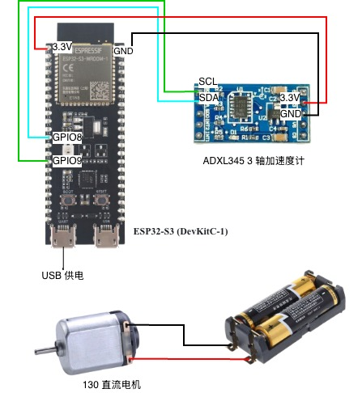

# TinyML 边缘侧电机故障实时诊断系统 (10.73 KB 极限压缩)


本项目展示了一个完整的 **TinyML (边缘人工智能)** 闭环落地案例。通过对深度学习模型进行“数学手术”，将模型压缩至 **10.73 KB**，成功部署在资源受限的 **ESP32-S3** 单片机上，通过三轴加速度计实现了对直流电机“正常运行”与“偏心故障（加螺钉）”状态的**毫秒级实时级阻断与诊断**。

---

## 📺 Demo 实操视频演示
我们在真实物理环境下搭建了测试台，并对软硬件联动的实时推理过程进行了录制。视频展示了当电机平稳运行（AI 输出故障率 ~0.2%）到人为加入螺钉载荷导致剧烈震动（AI 输出故障率飙升至 ~99%）的完整流程。

**点击下方链接查看 Bilibili 实验演示视频：**
🔗 [Bilibili 实验演示视频 | 智能诊断 Demo](https://www.bilibili.com/video/BV1EE5s6MEJ4/)

---

## ⚡ 项目核心亮点：何为“架构降维打击”？
在传统的深度学习工程中，全连接层 (Dense Layer) 会导致参数量爆炸，使微控制器无法承载。
本项目通过 **Global Average Pooling (全局平均池化, GAP)** 技术替代了传统的展平层 (Flatten)，实现了惊人的压缩比：
* **参数剧减：** 整个 1D-CNN 模型最终仅包含 **1,665 个参数**。
* **极致体积：** 最终导出的 TFLite 二进制模型（`model_data.h`）仅 **10,984 字节 (10.73 KB)**。
* **零延迟推理：** 在 ESP32-S3 上运行时，Tensor Arena（算盘内存）仅需 60 KB，推理延迟低至毫秒级，实现真正的边缘实时监控 (Predictive Maintenance, PdM)。

---

## 🛠️ 智能硬件与软件栈

### 1. 硬件架构 (Hardware Stack)
* **核心板 (MCU):** ESP32-S3 DevKitC-1 (运行主频 240MHz)
* **传感器 (Sensor):** ADXL345 三轴加速度计 (使用 I2C 通讯协议)
* **被测对象 (Target):** 直流电机 + 偏心负载螺钉（用于破坏动平衡，模拟物理转子故障）

### 2. 软件生态 (Software Stack)
* **模型训练:** TensorFlow 2.x + Keras / Jupyter Notebook (`notebooks/Phase6_retrain.ipynb`)
* **推理引擎:** TensorFlow Lite for Microcontrollers (TFLite Micro)
* **开发编译环境:** VS Code + PlatformIO 插件 (`platformio.ini`)

---

## ⚙️ 硬件接线参考
以下是我们设计的系统硬件拓扑连接图，ADXL345 传感器通过 I2C 总线与 ESP32-S3 的默认引脚相连，直流电机采用独立外部供电以隔绝电磁干扰。



| ADXL345 引脚 | ESP32-S3 引脚 | 说明 |
| :--- | :--- | :--- |
| **VCC** | 3.3V | 传感器供电 (严禁接5V) |
| **GND** | GND | 系统共地 |
| **SCL** | GPIO 9 | I2C 时钟线 (Clock) |
| **SDA** | GPIO 8 | I2C 数据线 (Data) |
| **CS** | 3.3V / VCC | 强置为高电平，激活 I2C 通讯模式 |

---

## 📐 核心实验步骤与实现

### 步骤 1：物理震动数据采集
利用 `tools/main_record.bak` 工具脚本，将采样率严格控制在 **10ms 时钟步长 (100Hz)**。分别录制并导出了两段真实的 Z 轴物理震动信号：
1. **正常基准线数据：** 电机不加螺钉，纯净旋转。
2. **故障异常数据：** 电机绑定螺钉，模拟转子不平衡引起的剧烈振动。

### 步骤 2：神经网络手术与 Retrain
在 `notebooks/Phase6_retrain.ipynb` 中导入生成的 `.csv` 样本数据。通过建立 `1D-CNN` 捕捉时间序列的频域特征。网络末端使用 GAP 层直接降维输出至单神经元。训练完成后，利用 `tf.lite.TFLiteConverter` 将模型转化为 C++ 字符数组。

### 步骤 3：MCU 边缘部署与闭环验证
将 `model_data.h` 嵌入到 PlatformIO 工程中。在 `src/main.cpp` 中，ESP32-S3 的硬件定时器每采集满 128 个连续震动点，就自动将其扣除重力基准面（基因对齐：`-1.1168f`），喂入 TFLite Micro 解释器执行 `interpreter->Invoke()`。

---

## 💻 快速开始 / 如何复现

1. **环境准备：** 在 VS Code 中安装 **PlatformIO** 插件。
2. **克隆仓库：**
   ```bash
   git clone [https://github.com/cheruidonglu/TinyML-Real-time-diagnosis-of-motor-faults.git](https://github.com/cheruidonglu/TinyML-Real-time-diagnosis-of-motor-faults.git)
3. **硬件连接：** 按照上文表格完成 ESP32-S3 与 ADXL345 的 4 线连接。
4. **烧录固件：** 使用数据线连接 Mac/PC 与 ESP32-S3，点击 PlatformIO 的 `Upload` 按钮进行编译与烧录。
5. **结果观测：** 打开串口监视器 (Serial Monitor)，波特率设为 `115200`。
* 当电机正常转动时，终端将持续输出：`诊断报告 > 故障概率: 0.2% 左右`
* 当人为给转子施加螺钉负载时，终端将瞬间跳变：`诊断报告 > 故障概率: 99.5% 左右`


---

## 📂 仓库文件指南

* `/src/main.cpp`: 边缘侧 TFLite Micro 推理主程序
* `/include/model_data.h`: 经压缩的 10.73 KB 二进制模型文件
* `/notebooks/Phase6_retrain.ipynb`: 模型结构设计与降维训练脚本
* `/platformio.ini`: 自动化驱动库依赖（Adafruit ADXL345）与编译器配置文件
